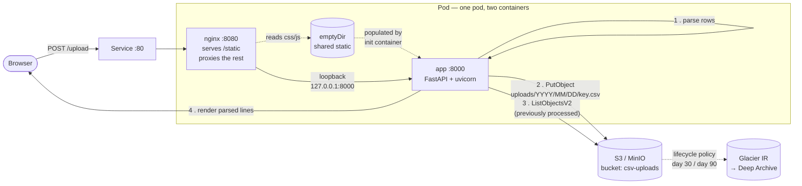
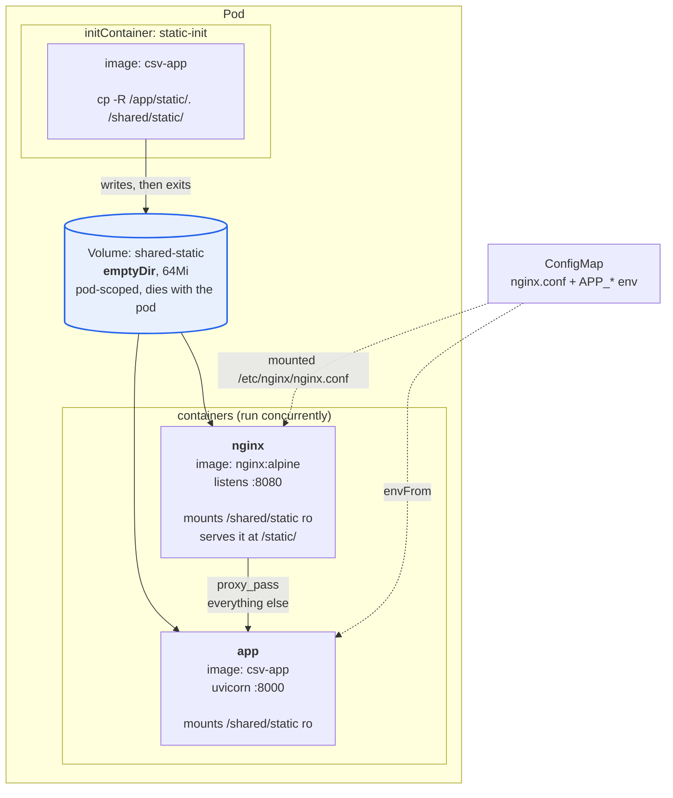
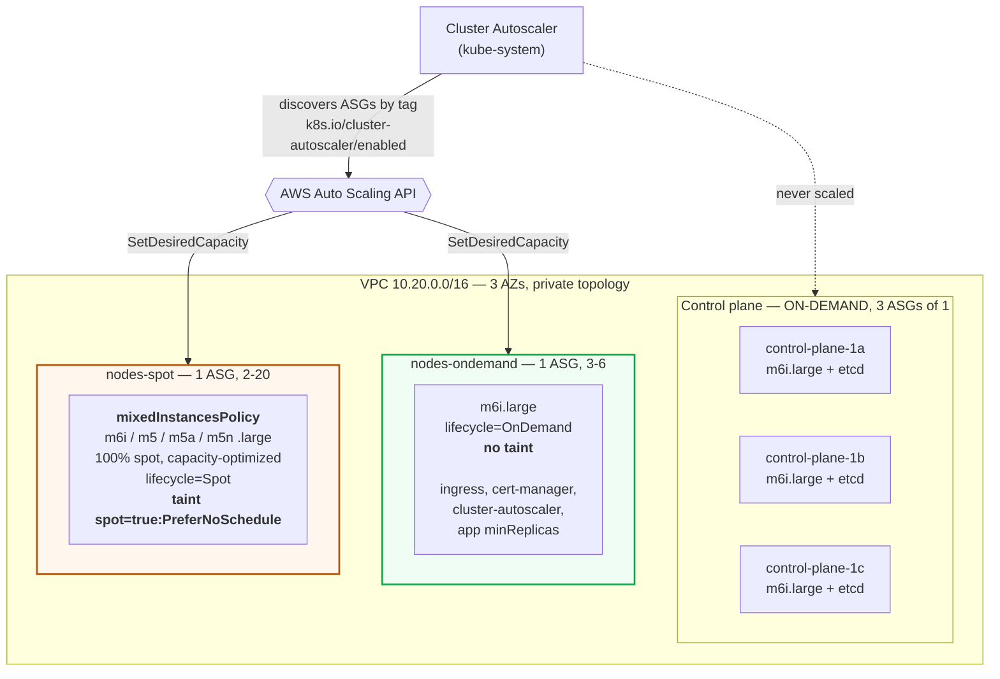
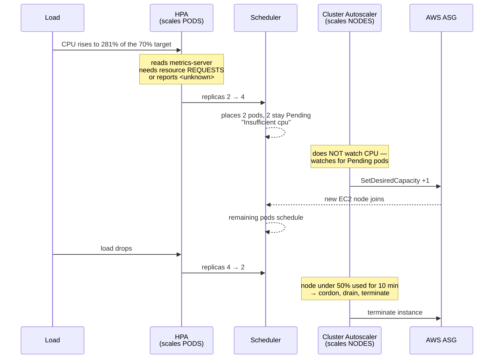
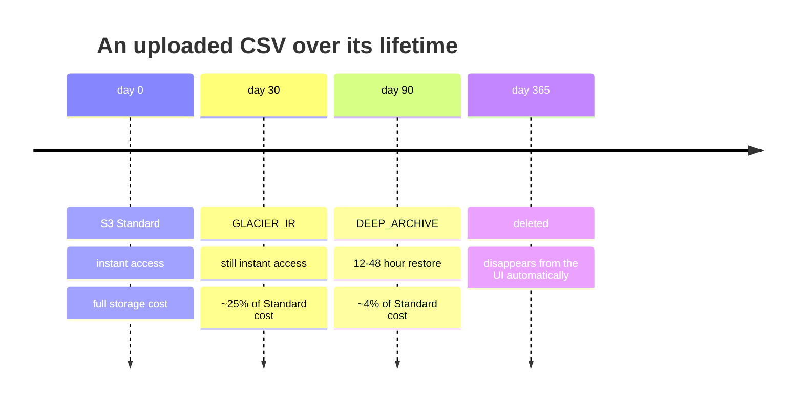
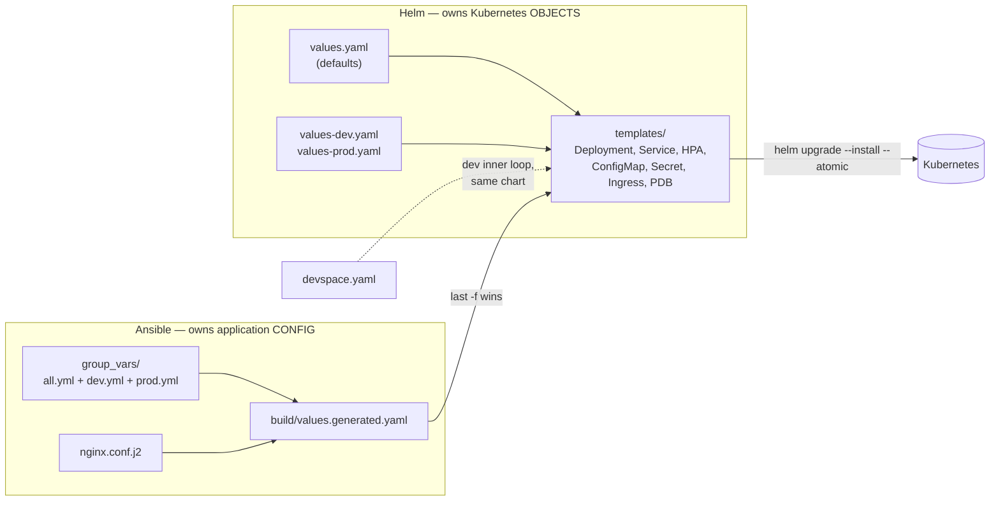
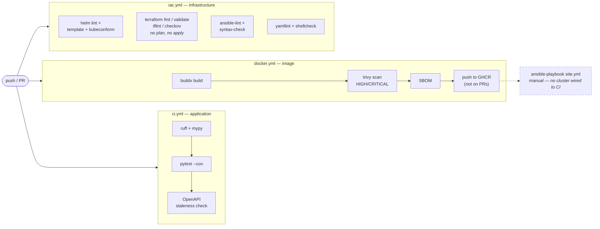

# Architecture

Diagrams are Mermaid, which GitHub renders natively — no image assets to fall
out of sync with the code.

---

## 1. Request and data flow

What happens when someone uploads a CSV.

The application keeps **no database**. "Previously processed files" is answered
by listing the bucket, which is what makes the app stateless and safe to scale
([ADR-0005](adr/0005-stateless-s3-listing-no-database.md)).

---

## 2. Inside the pod — the shared-storage mechanism

The case study requires nginx and the app in the **same pod**, sharing public
files through shared storage that is **not NFS**.

The static assets ship **inside the application image**. Nginx's image does not
contain them, so the init container copies them into a volume both containers
mount. No CSI driver, no StorageClass, no PVC, no NFS — and it behaves
identically on minikube and on a real cluster
([ADR-0004](adr/0004-emptydir-for-shared-static-assets.md)).

`make smoke` asserts the `X-Served-By: nginx-shared-volume` response header,
which only nginx's `/static/` block sets — proving the file came off the shared
volume rather than falling through to the app.

---

## 3. The kops cluster (never applied)

One `InstanceGroup` = one AWS Auto Scaling Group. The control-plane groups
deliberately carry **no** autoscaler discovery tags, so the autoscaler cannot
touch them. See [kops-explained.md](kops-explained.md).

---

## 4. The two autoscalers

They are different components and only one can be demonstrated locally.

| | HPA | Cluster Autoscaler |
|---|---|---|
| Scales | Pods | Nodes |
| Triggered by | CPU/memory utilisation | **Pending** pods |
| Needs | metrics-server + resource requests | An AWS ASG |
| Where | `charts/csv-app/templates/hpa.yaml` | `infra/kops/cluster-autoscaler-values.yaml` |
| On minikube | **works** — verified by `make load` | **impossible** — one node, no ASG |

---

## 5. Object lifecycle

Glacier **Instant** Retrieval for the first hop, because the application
re-reads archived files on demand and a minutes-to-hours restore would break
that. The day counts are **invented** — no retention policy was supplied
([ADR-0007](adr/0007-glacier-ir-before-deep-archive.md), `ASSUMPTIONS.md`).

---

## 6. Configuration and deployment flow

Who owns what, and how a change reaches a running pod.

Precedence: chart defaults → environment values → **Ansible's generated values
win**. `client_max_body_size` in nginx is *derived* from the application's
upload limit, so the two limits cannot disagree
([ADR-0008](adr/0008-helm-renders-k8s-ansible-owns-config.md)).

---

## 7. CI/CD

The image is **scanned before it is pushed**, not after — scanning afterwards
means shipping the vulnerability first. Terraform runs no `plan` and no `apply`:
there is no AWS account wired to this repository, deliberately
([ADR-0003](adr/0003-terraform-not-bound-to-aws-account-oidc.md)).
